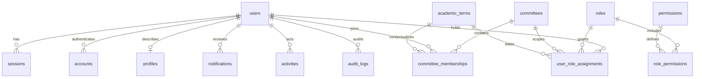
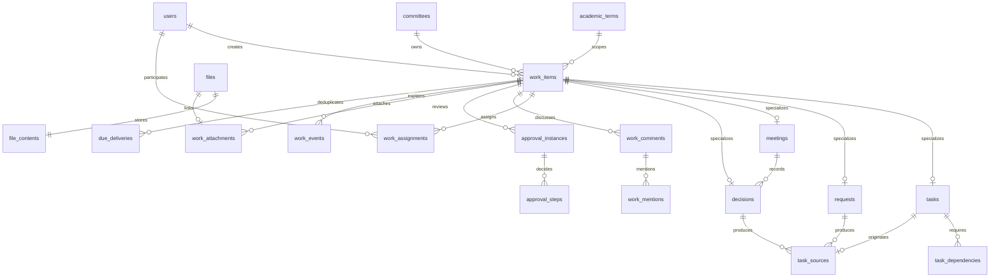
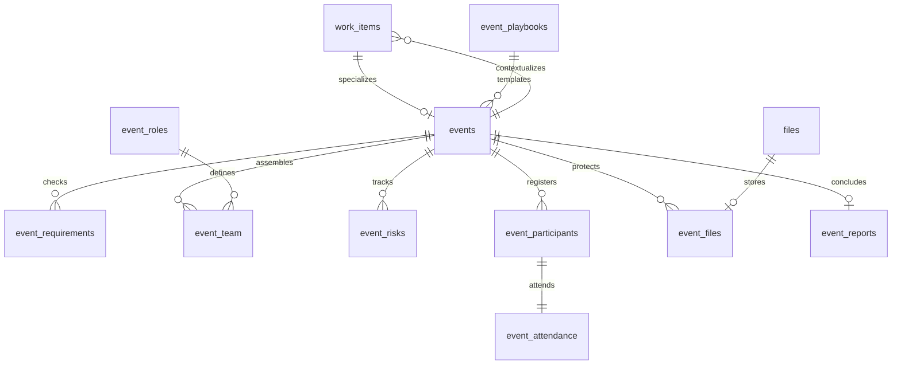

# النموذج العلائقي

المخطط المنفذ في src/db/schema.ts هو المصدر التنفيذي؛ migrations تاريخ النشر. الهجرة 0000 أساس المرحلة الأولى محفوظة دون إعادة كتابة؛ 0001 تضيف طبقة العمل. المخطط الأول للتنظيم، ومخططا المرحلتين الثانية والثالثة أدناه يصفان التنفيذ الحالي، بينما المخطط الشامل يوضح بقية المنصة.

## المخطط الشامل — المرجع التنفيذي في أقسام المراحل المنفذة

```mermaid
erDiagram
  academic_terms ||--o{ events : contains
  academic_terms ||--o{ tasks : contains
  events ||--o{ event_stages : progresses
  events ||--o{ event_tasks : links
  tasks ||--o{ event_tasks : linked
  tasks ||--o{ task_assignments : assigns
  tasks ||--o{ task_dependencies : requires
  tasks ||--o{ task_comments : discusses
  events ||--o{ event_attendance : records
  users ||--o{ event_attendance : attends
  requests ||--o{ request_comments : discusses
  meetings ||--o{ meeting_attendees : invites
  meetings ||--o{ decisions : decides
  reports ||--o{ report_reviews : reviews
  approval_flows ||--o{ approval_steps : defines
  approval_flows ||--o{ approval_instances : instantiates
  approval_instances ||--o{ approvals : records
  budgets ||--o{ expenses : allocates
  goals ||--o{ initiatives : guides
  goals ||--o{ kpis : measures
  kpis ||--o{ kpi_measurements : collects
  kpi_measurements ||--o{ kpi_evidence : proves
  files ||--o{ kpi_evidence : supports
  files ||--o{ attachments : links
  achievements ||--o{ badges : recognizes
  badges ||--o{ user_badges : awards
  users ||--o{ user_badges : earns
  users ||--o{ xp_transactions : accrues
  users ||--o{ impact_transactions : contributes
  monthly_star_cycles ||--o{ monthly_star_candidates : nominates
  monthly_star_candidates ||--o{ monthly_star_scores : evaluates
  playbooks ||--o{ playbook_steps : templates
  automation_rules ||--o{ automation_runs : executes
```

settings: مفاتيح مسموحة مع إصدار ونطاق. لا جدول EAV لكل المجال. القيم المالية decimal مع عملة؛ النقاط ledger لا رصيد قابل للتعديل. المرفقات لها وصلات نوعية وقيد مرجع وحيد. JSON محصور ببيانات الحدث وقوالب الشروط، وليس بديل علاقات. حذف المرجع التنظيمي مقيد للحفاظ على التاريخ. جميع الأوقات timestamptz، العرض Asia/Riyadh. فهارس الجلسات والتنبيهات والتعيينات حسب المستخدم. تدقيق append-only عبر trigger. مواسم التعيين والعضوية FK فعلية.

## المرحلة الثانية — المنفذ

١٧ جدولًا إضافيًا، وتصبح القاعدة ٣٣ جدولًا. التعيين الفريد للمسؤول والمراجع في work_assignments، والدعوات ممثلة بدور attendee ورد. قرارات المراجعة تحفظ في approval_steps وليست decisions؛ الأخيرة ذاكرة الاجتماعات المؤسسية. work_events يغذي الخط الزمني العربي، وaudit_logs يبقى منفصلًا. لا حذف متسلسل للعمل التاريخي. check constraints للحالات حسب نوع العنصر، الأولوية، المواعيد، نسب التقدم، عدم الاعتماد الذاتي، ومصدر المهمة الوحيد؛ الخدمة تتحقق من النوع والموسم وتمنع الدورات.

الهجرة 0002_rare_puma.sql تضيف notifications.work_id بعلاقة إلى work_items. تنبيهات المرحلة الأولى غير المرتبطة بعمل تبقى محفوظة. عند قراءة تنبيه عمل أو عرضه يعاد تقييده بصلاحية المورد الحالية، لمنع استمرار ظهور عنوان العمل بعد سحب النطاق.

## قاعدة الفعاليات — المرحلة الثالثة

الهجرة 0003_majestic_morlun.sql إضافية: ١٠ جداول، ليصبح الإجمالي ٤٣ جدولًا، مع توسيع قيدي نوع وحالة work_items دون تعديل هجرات الأساس. تضيف work_items.event_id وtrack، وapproval_instances.purpose. بيانات النموذج التنفيذي في schema.ts.

أرقام الميزانية هللات صحيحة بعملة SAR، لا floating point. سجل حضور واحد لكل مشارك مع check-in ومصدر ومسجل، وحقول توسع QR دون ماسح. uniqueness للبريد والرقم الجامعي داخل الفعالية، وقيود SQL للسعات والميزانيات والحالات ومقياس المخاطر ومدد الفريق. الحدث والمشاركة والحضور وروابط الملفات FK فعلية. event_playbooks.definition JSON مخصص للقالب فقط؛ المتطلبات الناتجة بيانات علائقية قابلة للتعديل. إعدادات الأدوار والقالب تزرع additively دون بيانات حضور أو فعاليات تجريبية.

